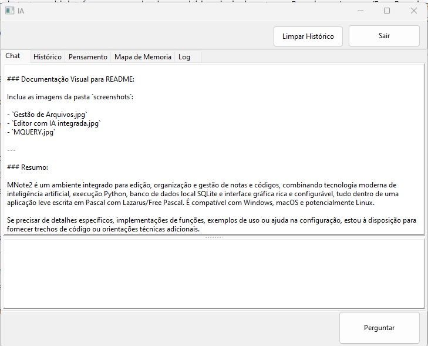
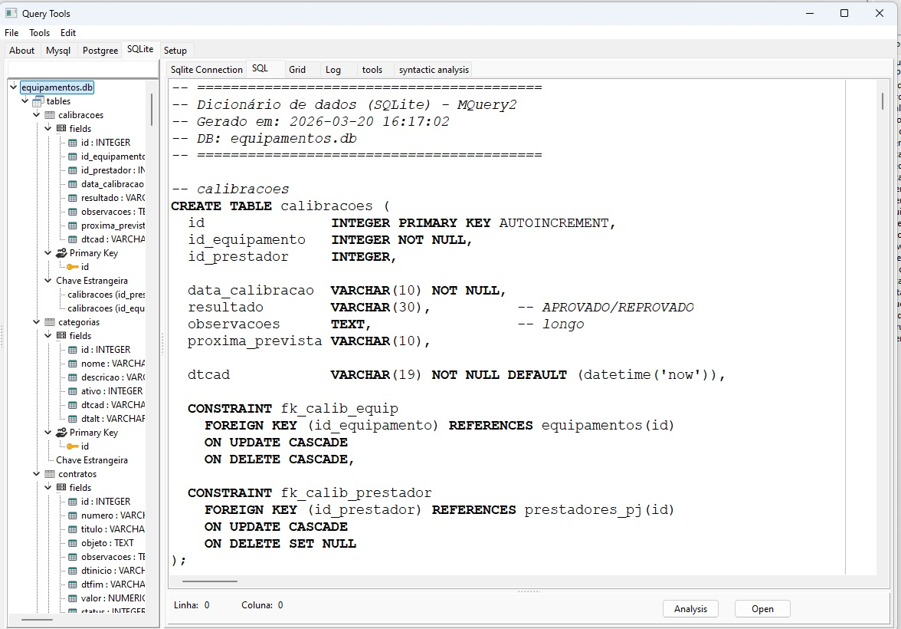

# MNote2

MNote2 是一个使用 Lazarus/Free Pascal 开发的跨平台文本和代码编辑器。它把多标签编辑、脚本执行、数据库工具、AI 集成、文档提取和语音辅助工具整合在一起。

当前源码版本：**2.63**。

## 截图

### 集成编辑器

### 文件管理

### 人工智能

### 数据库管理器

## 主要功能

### 编辑器和文件

- 基于 SynEdit 的多标签编辑器。
- 支持 Pascal、Python、Java、SQL、PHP、C 以及通过辅助列表配置的其他文件类型语法高亮。
- 搜索、替换、复制/粘贴、撤销/重做、块选择和字体设置。
- 在独立标签中打开和保存文件。
- 从 PDF、DOC 和 DOCX 提取文本。
- 使用关联的 .RIA 文件保存每个文件的对话历史。
- 与文件夹和项目组织集成。

### 项目、文件夹与 AI 分析

- 扫描文件夹并分析源代码和文档。
- 为每个文件生成技术摘要并缓存为 .RIA。
- 生成面向问题的分析并缓存为 .PIA。
- 当源文件在摘要之后发生变化时，会删除 .RIA 缓存。
- 生成文本思维导图以汇总问题中的相关要点。
- 在新分析中自动忽略 .RIA 和 .PIA 缓存文件。
- 支持 .pas、.pp、.lfm、.lpr、.ini、.json、.yml、.yaml、.php、.htm、.html、.js、.xml、.c、.cpp、.txt、.doc、.docx、.pdf、.sql、.jsp、.py、.cob、.md 等扩展名。

### 人工智能

- AI 客户端封装在 TCHATGPT 中，内部版本 1.5。
- 支持的提供商：OpenAI、OpenRouter、Cerebras 和兼容 /v1/chat/completions API 的本地/llama.cpp。
- 代码中预置的模型包括：gpt-3.5-turbo、gpt-4、gpt-4-turbo-preview、gpt-4o、gpt-o3-mini、gpt-4.1、gpt-4.1-mini、gpt-5。
- 还包含本地/Ollama 风格模型，例如 llama3.2:3b、Qwen 和 DeepSeek。
- 支持自定义模型。
- 可通过 IPLocalIA 配置本地端点。
- 对话历史、记忆地图和思考内容保存在 .RIA 文件中。
- 支持对话连续性分类。
- 从历史、记忆地图、项目、数据库和已分析文件中准备上下文。
- 支持 AI 辅助操作，包括生成 SQL 和创建表结构。

### Python 与自动化

- 通过 PythonEngine 执行编辑器中的 Python 代码。
- 可配置 Python DLL 路径。
- 执行输出会发送到结果区域。
- 执行后可检查全局和局部变量。
- 可配置外部脚本用于 run、debug、clean、install 和 compile。
- 示例位于 sample/python、sample/gcc，以及 src 下的辅助脚本。

### 数据库与 MQuery2

MQuery2 作为内置 SQL 管理器运行。

- 通过 Zeos 连接 MySQL、PostgreSQL 和 SQLite。
- 配置 MySQL、PostgreSQL 和 SQLite 的 DLL/SO 库。
- 根据当前连接浏览数据库树、表、字段、视图、过程、函数、触发器和序列。
- 从集成编辑器执行自由 SQL。
- 根据选中的表生成 SQL。
- 从 CSV 数据集创建表。
- 创建 PostgreSQL 用户。
- 为 PostgreSQL 和 SQLite 生成数据字典。
- 为 SQLite 和 PostgreSQL 生成依赖和外键列表。
- 集成 AI 来分析 SQL、提出改进、整理查询，并基于 DDL 和依赖回答问题。
- TSQLiteDb 提供 SQLite 连接、事务、推荐的 pragmas、参数化执行和实用查询。
- TProjetoDB 打开 SQLite 项目、检查表并加载元数据和配置。

### 语音工具

- ToolsFalar 通过 TCP 将文本发送到语音合成服务，例如 srvFalar。
- ToolsOuvir 通过 TCP 接收外部命令和消息。
- 可根据配置在启动时自动启用。
- IP 和端口可在界面中设置。

### 安装与分发

- Windows 安装程序使用 Inno Setup，位于 instalador/MNote2.iss。
- Windows 安装器版本：2.63。
- 会复制 MNote2.exe、DLL、.dci 文件、.txt 列表、.bat 脚本、示例和默认数据库。
- 默认数据库复制到 C:db。
- 包含安装后启动 srvFalar_1.4.exe 的选项。
- 历史二进制和安装包位于 bin。
- buildlinux.sh 保持 Linux/deb 打包流程。

## 项目结构

- src/MNote2.lpr：Lazarus 应用入口。
- src/main.pas：主窗体、标签页、编辑器、加载/保存、聊天、历史、工具和整体集成。
- src/classes/item.pas：封装每个可编辑标签/项、Python 执行和配置脚本。
- src/classes/chatgpt.pas：AI 提供商的 HTTP 客户端。
- src/setmain.pas：全局配置和 mnote.cfg 持久化。
- src/config.pas：脚本、DLL、AI、数据库和 TCP 工具的配置窗体。
- src/folders.pas：文件夹管理、文件分析、.RIA/.PIA 缓存以及基于 AI 的项目分析。
- src/ia.pas：AI 界面，包含历史、记忆地图、思考、连续性和动作。
- src/mquery2/mquery2.pas：数据库和 SQL 管理器。
- src/sqlite_db.pas：SQLite 封装。
- src/uprojetodb.pas：SQLite 项目加载和元数据。
- src/uPdfText.pas：简单的原生 PDF 文本提取。
- src/uDocText.pas：DOC/DOCX 文本提取。
- src/toolsfalar 和 src/toolsouvir：TCP 语音工具。
- db/projeto_padrao.db：默认项目数据库。
- screenshots：README 使用的图片。
- instalador：Windows 打包脚本。
- sample：Python、C 和图像处理示例。
- libs、sqlite 和 tools：项目随附的外部库和工具。

## 需求

### 开发

- Lazarus IDE 和 Free Pascal Compiler。
- 项目使用的 Lazarus 包，包括 LCL、SynEdit、TAChart、Indy、Zeos、RX、Python4Lazarus、lNet 和 src/MNote2.lpi 中列出的额外组件。
- 需要的数据库库：SQLite、MySQL 客户端，以及根据配置使用的 PostgreSQL/libpq/ODBC。
- 当启用 Python 执行时，需要与已配置 DLL 兼容的 Python 3。
- 生成 Windows 安装包需要 Inno Setup。

### 使用

- 项目主要面向 Windows 和 Linux。
- 经典 .doc 文件需要在安装了 Microsoft Word 的 Windows 上使用。
- AI 功能需要配置好的 token/提供商或兼容的本地服务器。
- 语音工具需要对应的 TCP 服务正在运行。

## 配置

主要配置保存在 mnote.cfg 中，由 TSetMain 管理。它包含：

- 窗口位置、大小和字体。
- 最近文件。
- run/debug/clean/install/compile 脚本。
- AI token 和提供商。
- 本地 AI 端点。
- Python、MySQL 和 PostgreSQL 的 DLL 路径。
- MySQL、PostgreSQL 和 SQLite 的连接信息。
- ToolsFalar 和 ToolsOuvir 的启用状态与 IP 设置。
- 默认文件夹和当前项目。

注意：mnote.cfg 可能包含 AI token 和数据库密码，请在本地妥善保护。

## 快速使用

1. 打开 MNote2。
2. 在设置中配置 DLL 路径、脚本、数据库和 AI。
3. 在编辑器标签中打开或创建文件。
4. 用语言菜单选择文件/代码类型。
5. 直接运行 Python 或已配置的外部脚本。
6. 打开 MQuery2 连接 MySQL、PostgreSQL 或 SQLite。
7. 在 AI 面板中使用历史、记忆地图和项目分析进行提问。
8. 使用文件夹管理器生成 .RIA 摘要和 .PIA 分析。
9. 需要 TCP 语音集成时启用 ToolsFalar/ToolsOuvir。

## 维护说明

- 当前代码的主要逻辑集中在 main.pas、folders.pas、ia.pas 和 mquery2.pas。
- 仓库会同时版本化二进制、安装包和外部库，因为项目会把这些产物和源码一起分发。
- .RIA 和 .PIA 文件用于 AI 缓存/输出，可由应用重新生成。
- src/lib 包含项目各平台的 Lazarus/Free Pascal 编译产物。

## 许可

参见 LICENSE 文件。
