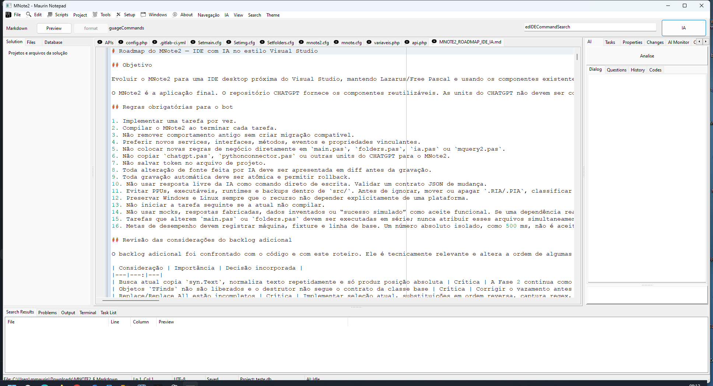
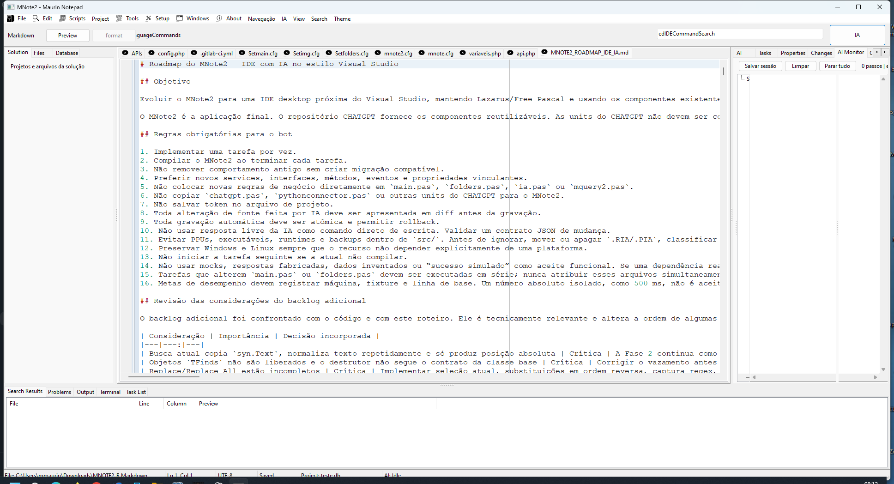

# Manual do usuário — MNote2 IDE com IA

Este manual descreve a interface e os recursos entregues na versão 2.63 do
MNote2.



## 1. Interface da IDE

A área central contém os documentos abertos em abas. As janelas de ferramenta
ficam organizadas como em uma IDE:

- esquerda: Solution, Files e Database;
- direita: AI, Tasks, Properties, Changes, AI Monitor e AI Components Lab;
- inferior: Search Results, Problems, Output, Terminal e Task List.

O menu **View** mostra ou oculta cada painel. **View > Reset Layout** recupera
as posições e tamanhos iniciais. O layout é preservado ao fechar normalmente o
programa. A barra de status mostra linha, coluna, linguagem, codificação, estado
da IA e estado do projeto.

## 2. Arquivos, comandos e atalhos

Use **File > New**, **Load**, **Save** e **Save as** para trabalhar com
documentos. O painel Files faz a varredura da raiz do projeto sem travar a tela
e permite abrir arquivos encontrados.

Atalhos principais:

| Atalho | Ação |
|---|---|
| `Ctrl+N` | novo documento |
| `Ctrl+L` | abrir arquivo |
| `Ctrl+S` | salvar |
| `Ctrl+Shift+S` | salvar todos |
| `Ctrl+F` ou `F3` | localizar |
| `Ctrl+H` | substituir |
| `F3` / `Shift+F3` | próxima/anterior ocorrência |
| `Ctrl+Shift+H` | Replace in Files |
| `Ctrl+Q` ou `Ctrl+Shift+P` | paleta de comandos |
| `Ctrl+P` | abrir arquivo rapidamente |
| `F12` | ir para definição |
| `Shift+F12` | localizar referências |
| `Ctrl+Alt+Space` | sugestão explícita da IA |

A paleta pesquisa por nome e categoria; por exemplo, digitar “salvar” permite
executar **Salvar Tudo** sem navegar pelos menus.

## 3. Linguagens, tema e autocomplete

A linguagem é identificada pela extensão e aparece na barra contextual. Há
perfis para Pascal/Lazarus, Python, SQL, JavaScript, JSON, XML, HTML, CSS,
Markdown e arquivos de texto/configuração. Comentários e opções editoriais
respeitam o perfil atual.

O tema e a fonte são persistidos. Se um tema JSON for inválido, o MNote2 usa o
tema de fallback e registra o problema.

O autocomplete local agrega palavras da linguagem, identificadores do buffer,
símbolos Pascal do projeto, snippets e objetos do dicionário SQL. Ele é
determinístico e não chama a internet. Sugestão de código por IA é uma ação
separada e explícita em `Ctrl+Alt+Space`; os dois popups não se sobrepõem.

## 4. Busca e substituição

A barra de busca funciona sem bloquear a edição. Ela oferece:

- busca literal, palavra inteira e expressão regular;
- destaque de ocorrências e contador;
- documento atual, documentos abertos ou arquivos da raiz;
- máscaras Include/Exclude e exclusão de binários;
- progresso, cancelamento e histórico;
- navegação exata por linha e coluna, inclusive em UTF-8.

Replace in Files sempre apresenta preview. É possível desmarcar arquivos antes
do Apply. A operação usa backup, escrita atômica e rollback; uma falha em um
arquivo restaura o que já havia sido alterado.

## 5. Projetos e tarefas

Crie ou abra um projeto pelo menu **Project**. A aba Tasks permite criar,
editar, confirmar, iniciar e concluir tarefas. Cada tarefa pode conter descrição
longa, critérios de aceite, dependências, estimativas, perfil responsável,
arquivos, restrições, commits e arquivos exclusivos.

O histórico registra estado anterior e novo. Gantt, Timeline e Risk Matrix
aparecem como visões opcionais e mostram uma mensagem clara quando não há
dados. Task List indexa `TODO`, `FIXME`, `HACK`, `NOTE` e tokens configurados nos
fontes; um comentário pode originar uma tarefa mantendo arquivo e linha.

Planos gerados por IA são contratos JSON validados. A revisão usa checkboxes,
mantém revisões anteriores e só persiste a substituição depois da confirmação.

## 6. Conversa digitada e conversa por voz

O comportamento depende da entrada:

- pergunta digitada: a resposta aparece por escrito e não é falada;
- comando reconhecido por voz: a resposta aparece no histórico e é falada.

O padrão de ativação é **“OK MNote”**, no mesmo conceito de “OK Google”. Uma
frase recebida por voz sem o prefixo não é enviada à IA. Dizer apenas “OK MNote”
faz o programa responder “Estou ouvindo”. Exemplo:

```text
OK MNote, explique a função selecionada
```

Ative e configure ToolsOuvir para o serviço de reconhecimento TCP. Configure
ToolsFalar para o serviço de síntese; no Windows, a fala possui fallback real
por SAPI quando o serviço TCP não está disponível. A frase de ativação pode ser
alterada na configuração. Se voz estiver desativada ou indisponível, o programa
informa o estado e continua funcionando por texto.

## 7. IA e confirmação de dúvidas

Providers configuráveis: OpenAI, OpenRouter, Cerebras, servidor local
compatível e Gemini. Tokens ficam apenas no `mnote.cfg` local.

A IA usa camadas separadas de Gestão, Triagem, Trabalho Leve, Recuperação,
Árbitro e Banco. O router escolhe o perfil por regras reproduzíveis. Quando
faltam objetivo, escopo ou autorização relevantes, Gestão pergunta e aguarda a
confirmação; a dúvida não é convertida em ação por suposição.

O orçamento mostrado é uma estimativa, não uma contagem exata. O programa
separa janela de entrada e saída reservada, limita tentativas e rodadas,
classifica erros antes de retry e bloqueia ciclos entre agentes. **Parar IA**
cancela a sessão ativa.

O AI Monitor mostra a árvore de solicitações, decisões, ações, resultados,
tentativas, orçamento e motivos de roteamento sem revelar tokens.



## 8. Alterações de fonte propostas pela IA

**IA > Propor correção com IA** cria uma proposta; nenhum fonte muda nessa
etapa. O painel Changes mostra original, proposta e diff. É possível aceitar ou
rejeitar arquivos e hunks individuais.

O Apply exige confirmação explícita e valida novamente caminho, texto esperado
e hash. Depois grava de forma atômica, mantém backup/histórico e executa a
validação configurada. Se o teste falhar, a tarefa não é concluída e o rollback
é oferecido. O rollback recusa apagar uma alteração manual feita depois do
Apply.

## 9. Banco de dados e SQL

MQuery2 continua executando consultas solicitadas diretamente pelo usuário. A
aba Data Dictionary reutiliza a mesma conexão Zeos:

- PostgreSQL e SQLite: suportados;
- MySQL, Firebird, Oracle e MSSQL: experimentais;
- protocolo desconhecido: indisponível.

O dicionário pode ser exportado sem consultar novamente e alimenta autocomplete
e contexto resumido para IA. A IA de banco recebe metadados, propõe SQL e valida
placeholders, mas nunca executa o SQL gerado. A transferência ao editor principal
exige confirmação. Em produção, revise especialmente `UPDATE`, `DELETE`,
`DROP`, `ALTER` e `CREATE`.

## 10. Build, Problems, Output e Terminal

Build e Rebuild escolhem o perfil do projeto e executam processo real fora da
UI. Stdout e stderr aparecem no canal Build do Output. Mensagens FPC/Lazarus são
convertidas em Problems com arquivo, linha, coluna, severidade e código; duplo
clique abre a posição. **Parar Build** cancela o processo.

O Output mantém canais independentes, incluindo Build e AI. Limpar um canal não
apaga os outros. O Terminal inicia na raiz do projeto e executa somente o comando
digitado pelo usuário.

## 11. Files, documentos e Components Lab

Files gera inventário real da raiz. As ferramentas de documento exportam dados
para TXT e PDF e pedem confirmação antes de gravar. O grafo distingue relações
factuais das inferidas.

AI Components Lab lista cada capacidade e sua disponibilidade. Chromium/CEF,
visão, ML, rede, industrial e hardware são opcionais; a ausência deles nunca
impede o núcleo da IDE de iniciar e não é apresentada como integração simulada.

## 12. Configuração, privacidade e diagnóstico

`mnote.cfg` fica no perfil local do usuário e pode conter tokens, senhas de
banco, endpoints, paths e preferências. Não publique esse arquivo. Use
`mnote.example.cfg` como modelo seguro.

Arquivos de projeto, sessão e relatório não devem conter credenciais. O MNote2
limita tamanho de contexto e saída, não segue caminhos para fora da raiz e não
executa instruções encontradas dentro do conteúdo de um arquivo.

Em caso de problema:

- IA: confira provider, modelo, token, rede e o motivo no AI Monitor;
- voz: confira ToolsOuvir/ToolsFalar, IP, porta e a frase “OK MNote”;
- Python: confira DLL, versão e arquitetura;
- banco: confira protocolo Zeos, biblioteca cliente e conexão;
- build: confira Output e Problems;
- layout: use **View > Reset Layout**.
